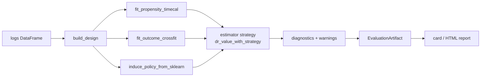

# Architecture tour

This is a contributor-facing map of how an evaluation flows through
`skdr-eval`, one stop per module. It is the companion to the
[write-your-own-estimator guide](extending/add-an-estimator.md): read this to
understand the pipeline, read that to extend it.

For the *public* names each stage exposes, see the
[API stability page](api-stability.md). For the statistical invariants the
pipeline must preserve, see `docs/agent-context/invariants.md`.

## The pipeline at a glance

## Stage by stage

**1. Validation — `validation.py`.** `validate_logs` /
`validate_pairwise_inputs` are the front door for arbitrary user data: schema,
eligibility columns, finite rewards, time ordering. `doctor.py` wraps these in
a non-raising preflight battery (`DoctorReport`).

**2. Design matrices — `core.py::build_design`.** Turns a logs frame into the
`Design` dataclass: `X_base` (context features), `X_obs` (context + action
one-hot), `X_phi` (propensity-model features), the action vector `A`, outcomes
`Y`, timestamps `ts`, and the eligibility matrix `elig`.

**3. Propensity nuisance — `core.py::fit_propensity_timecal`.** Cross-fitted,
time-calibrated logging-policy propensities, respecting temporal order
(time-series splits, not random folds). Calibration quality is later surfaced
as ECE/Brier in the diagnostics.

**4. Outcome nuisance — `core.py::fit_outcome_crossfit`.** Cross-fitted outcome
model `q̂`. Accepts a `sample_weight` hook — this is the seam `MRDRWeightedLoss`
uses to fit the variance-minimizing MRDR outcome model.

**5. Policy induction — `core.py::induce_policy_from_sklearn`.** Converts a
scikit-learn candidate model into a target-policy probability matrix over
eligible actions (vectorized; fails loud on non-finite predictions per the
invariants).

**6. Estimator — `estimators/`.** The strategy seam. A
`EstimatorStrategy(name, weight_transform, outcome_loss, self_normalised)`
pairs a `WeightTransform` (how raw `1/π` becomes a working weight) with an
`OutcomeLoss` (the cross-fit sample weights). `dr_value_with_strategy(...)`
runs the DR computation and returns a `DRResult` (V̂, SE, ESS, tail mass,
Pareto-k, …). Built-ins:

| Module | Provides |
|---|---|
| `estimators/protocols.py` | `WeightTransform`, `OutcomeLoss`, `EstimatorStrategy`, `TransformContext` |
| `estimators/weight_transforms.py` | `ClipTransform`, `IdentityTransform`, `SwitchTauTransform`, `DRosShrinkTransform`, `MIPSTransform` |
| `estimators/outcome_losses.py` | `MSEOutcomeLoss`, `MRDRWeightedLoss` |
| `estimators/core.py` | `dr_value_with_strategy` |
| `estimators/__init__.py` | `build_strategy` (named-strategy factory) |
| `estimators/mips.py` | `mips_value`, `embedding_sufficiency_diagnostic` |

**7. Diagnostics & warnings — `diagnostics.py`, `reporting.py`.** Per-action
propensity diagnostics, support-health classification (`ok` / `caution` /
`high_risk`) from ESS, tail mass, match-rate, Pareto-k, and calibration, plus
the clip-grid sensitivity sweep.

**8. Artifact & card — `reporting.py`.** Everything lands in a single
versioned `EvaluationArtifact` (`report`, `detailed`, `warnings`,
`sensitivity`, `diagnostics`, `metadata`). It exports to JSON
(`SCHEMA_VERSION`), HTML, and a stakeholder `EvaluationCard`
(`CARD_SCHEMA_VERSION`) carrying the deploy/don't-deploy `Recommendation`.

**9. CLI — `cli.py`.** A thin Typer wrapper exposing `doctor`,
`validate-schema`, `evaluate`, `pairwise`, `card`, and `version`, with stable
exit codes for CI gates (`3` = a `do_not_deploy` verdict).

## Adjacent surfaces

- **`adapters/`** — map external data in: the generic trace adapter
  (`from_records`, `from_jsonl_trace`) and GBDT model wrappers.
- **`slate/`** — the ranked-list estimator family and its synthetic generator.
- **`pairwise.py`** — the call-routing / autoscaling layer the project grew
  from.
- **`datasets/`** — public-dataset loaders (`load_obd`; Criteo/MovieLens stubs).
- **`trackers/`** — `NullTracker` / `FileTracker` plus optional MLflow / W&B /
  Aim seams.

## Where the invariants bind

The statistical invariants in `docs/agent-context/invariants.md` are enforced
at specific stages: fail-loud on non-finite predictions (stage 5), strictly
positive matched propensities (stage 6), and the simulation-proof requirement
for any change to estimation logic (stages 3–6). Any contribution touching
those stages must keep the corresponding `tests/sim_studies/` proof green.

## See also

- [Write your own estimator](extending/add-an-estimator.md)
- [API stability & inventory](api-stability.md)
- [Methods (DR / SNDR)](methods.md)
