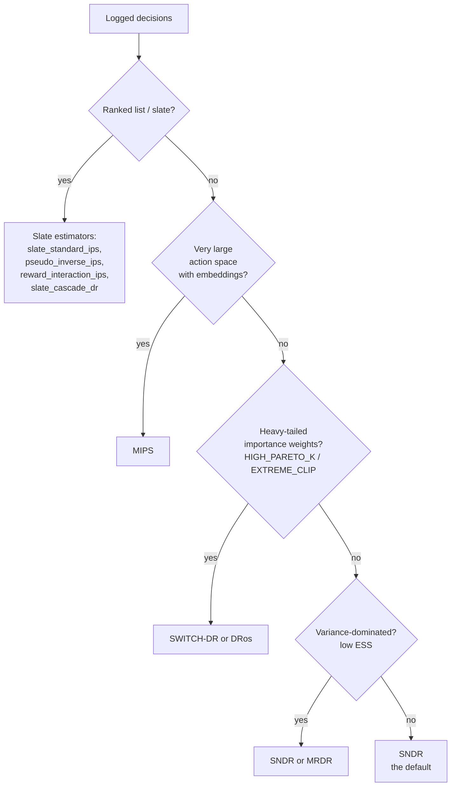

# Choosing an estimator

`skdr-eval` ships a family of estimators — `DR`, `SNDR`, `MRDR`, `SWITCH-DR`,
`DRos`, `MIPS`, plus four slate estimators. This page answers the two
questions that matter in practice: **which one should I run**, and **when
should I care that they disagree?**

If you only remember one thing: start with **SNDR**. It is the
variance-stabilized default and the right first estimator for almost every
contextual-bandit evaluation. Reach for the others when a specific diagnostic
tells you to.

## Decision flowchart



## Estimator reference

Each row ties the estimator to the diagnostic that exposes its characteristic
failure mode. Claims here are no stronger than the
[statistical validation matrix](statistical-validation-matrix.md) demonstrates.

| Estimator | Assumes / does | Shines when | Failure mode | Diagnostic that guards it |
|---|---|---|---|---|
| **DR** | doubly-robust baseline; hard-clipped IPS weights + outcome model | overlap is healthy and you want the canonical estimate | heavy weight tails inflate variance | ESS, `tail_mass`, PSIS Pareto-k |
| **SNDR** | self-normalized DR (default) | almost always — stabilizes the weight normalization | small residual bias from self-normalization | clip-grid sensitivity |
| **MRDR** | more-robust DR; outcome model fit with `w²` weights to minimize DR variance | variance-dominated regimes | needs a flexible outcome model | ESS, calibration (ECE/Brier) |
| **SWITCH-DR** | zeroes the IPS term above a weight threshold `tau` | a few extreme weights dominate | bias from the switched-off tail | `tail_mass`, sensitivity to `tau` |
| **DRos** | optimistic shrinkage `w·λ/(w²+λ)` | heavy tails, want a smooth alternative to hard switching | bias controlled by `λ` choice | sensitivity sweep over `λ` |
| **MIPS** | marginalizes over an action **embedding** sufficient statistic | huge action sets where direct overlap is hopeless | embedding insufficiency | `embedding_sufficiency_diagnostic` |

Build any of them by name:

```python
import skdr_eval

strategy = skdr_eval.build_strategy("SWITCH-DR", tau=5.0)
# DR / SNDR / MRDR / SWITCH-DR / DRos / MIPS  (case-insensitive)
```

The high-level evaluators report DR and SNDR by default; the strategy seam
(`skdr_eval.estimators`) is how the rest plug in — see
[architecture](architecture.md) and the
[write-your-own-estimator guide](extending/add-an-estimator.md).

## Running several estimators at once

Running more than one estimator is the cheapest robustness check you have: if
they agree, the estimate is not an artifact of one estimator's bias profile.

```python
artifact = skdr_eval.evaluate_sklearn_models(
    logs=logs,
    models={"candidate": model},
    y_col="reward",
    fit_models=True,
    policy_train="pre_split",
)
# artifact.report has one row per (model, estimator); DR and SNDR by default.
print(artifact.report[["model", "estimator", "V_hat", "SE_if", "ESS"]])
```

## When estimators disagree

Disagreement is information, not noise:

- **DR vs. SNDR diverge** → the self-normalization is doing real work, which
  points at unstable importance weights. Check ESS and `tail_mass`; consider
  SWITCH-DR or DRos.
- **DR/SNDR vs. MRDR diverge** → the outcome model matters more than you
  thought. Check calibration (ECE/Brier) and the outcome-model fit.
- **MIPS disagrees with the discrete estimators** → the embedding may not be a
  sufficient statistic; run `embedding_sufficiency_diagnostic`.
- **Any estimator moves sharply across the clip grid** → the estimate is
  dominated by a handful of weights. Treat the result as low-trust regardless
  of which estimator looks best.

The honest reading of large, unexplained disagreement is "the logs do not pin
this estimate down" — which is exactly the
[support-health](report-interpretation.md) story.

## See also

- [Methods (DR / SNDR)](methods.md) — the math behind the family.
- [Metrics glossary](metrics-glossary.md) — every diagnostic column.
- [Slate vs pairwise vs standard](slate-vs-pairwise-vs-standard.md) — when to
  use the slate estimators.
- [Statistical validation matrix](statistical-validation-matrix.md) — the
  evidence each claim rests on.
